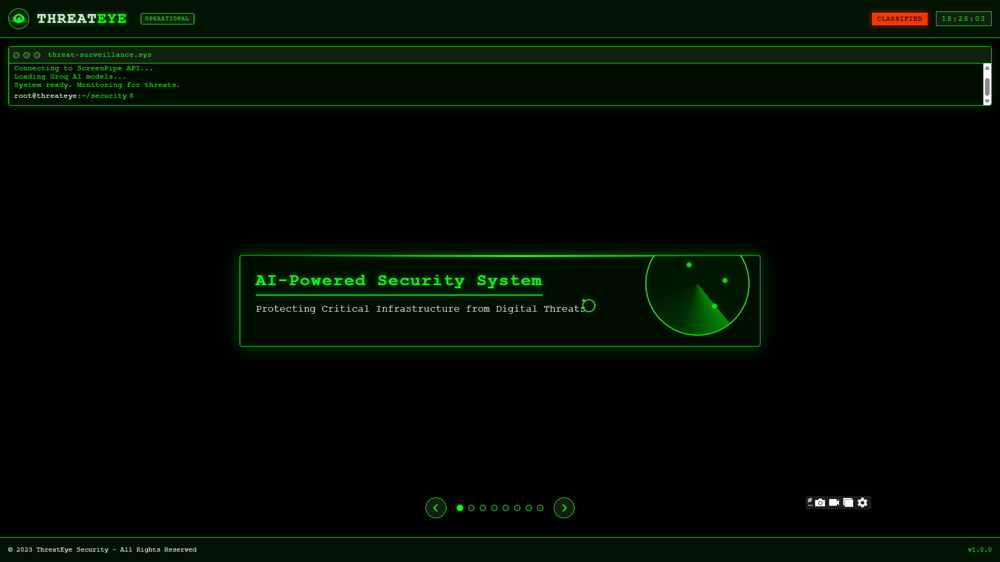

# ThreatEye - AI-Powered Security System

[](https://threateye.netlify.app/)



ThreatEye is an advanced AI-powered security system that monitors computer screens and audio in real-time to detect and flag extremist content or terror-related activity, providing immediate alerts to security personnel.

## Problem ThreatEye Solves

Terror plots and violent radicalization often develop undetected in online spaces. Traditional monitoring methods are overwhelmed by the sheer volume of digital content. ThreatEye addresses this by providing automated, continuous surveillance of digital environments, identifying dangerous imagery, extremist symbols, hate speech, and suspicious activity patterns before they escalate into real-world threats.

## Core Features

- **Continuous Screen & Audio Monitoring**: Uses ScreenPipe technology to capture and analyze screen content and audio in real-time
- **AI-Powered Threat Detection**: Leverages Groq's high-performance AI to detect extremist imagery, symbols, and text through:
  - Image recognition for weapons, extremist logos, and suspicious visuals
  - NLP analysis for hate speech and extremist terminology
  - Pattern recognition for identifying suspicious activity sequences
- **Real-time Alert System**: Triggers immediate notifications when potential threats are detected
- **Investigation Console**: Web dashboard for security personnel to review and manage alerts
- **Secure Desktop Agent**: Electron-based application for endpoint monitoring with minimal system footprint

## Architecture

ThreatEye consists of two main components:

### 1. Desktop Agent

- **Technology**: Electron, Node.js
- **Features**:
  - Screen capture and analysis using ScreenPipe
  - Local AI processing with Groq integration
  - Secure, encrypted communication with the central server
  - Minimal system footprint with background operation
  - Configurable monitoring parameters

### 2. Web Console

- **Technology**: Next.js, React, TailwindCSS
- **Features**:
  - Real-time alert dashboard
  - Historical detection analytics
  - Alert management system
  - User authentication and role-based access
  - Endpoint management
  - API for desktop agent communication

## Technology Stack

- **Frontend**: Next.js, React, TailwindCSS, Framer Motion
- **Desktop App**: Electron, Node.js
- **AI Services**: Groq API for high-performance inference
- **Monitoring**: ScreenPipe for screen and audio capture
- **Security**: Encrypted communications, secure API endpoints with JWT authentication

## Getting Started

### Prerequisites

- Node.js 18.x or higher
- npm or yarn
- ScreenPipe SDK (for development)
- Groq API key

### Installation

#### Web Console

1. Clone the repository:
   ```
   git clone https://github.com/your-organization/threateye.git
   cd threateye
   ```

2. Install dependencies:
   ```
   npm install
   ```

3. Set up environment variables:
   Create a `.env.local` file in the root directory with:
   ```
   GROQ_API_KEY=your_groq_api_key
   ```

4. Run the development server:
   ```
   npm run dev
   ```

5. Open [http://localhost:3000](http://localhost:3000) in your browser.

#### Desktop Agent

1. Navigate to the desktop app directory:
   ```
   cd threateye/desktop-app
   ```

2. Install dependencies:
   ```
   npm install
   ```

3. Run the development version:
   ```
   npm run dev
   ```

### Building for Production

#### Web Console
```
npm run build
npm run start
```

#### Desktop Agent
```
npm run build
```
This will create distributable packages in the `dist` directory.

## API Documentation

ThreatEye provides the following API endpoints:

### Authentication
- `POST /api/auth/login`: Authenticate users
- `POST /api/auth/logout`: End user session

### Devices
- `GET /api/devices`: List all registered monitoring devices
- `GET /api/devices/:id`: Get specific device information
- `POST /api/devices`: Register a new monitoring device
- `DELETE /api/devices/:id`: Unregister a device

### Detections
- `POST /api/detections`: Submit a new detection from a device
- `GET /api/detections`: Get all detections with filtering options
- `GET /api/detections/:id`: Get specific detection details
- `PATCH /api/detections/:id`: Update detection status (e.g., mark as reviewed)

### Settings
- `GET /api/settings`: Get system settings
- `PUT /api/settings`: Update system settings

See the full API documentation at `/api/docs` when running the application.

## Security Considerations

ThreatEye is designed with security as a top priority:

- All communications between desktop agents and the web console are encrypted
- Detection data is stored securely with access controls
- API endpoints use proper authentication and authorization
- Privacy measures ensure monitoring is performed responsibly

## Presentation

View our interactive presentation at [https://threateye.netlify.app/](https://threateye.netlify.app/) for a visual overview of ThreatEye's capabilities featuring a military-themed interface with glowing green animations.

## License

This project is proprietary and confidential. Copyright © 2023 ThreatEye Security.

## Contact

For any inquiries, please contact [your-email@example.com](mailto:your-email@example.com).
